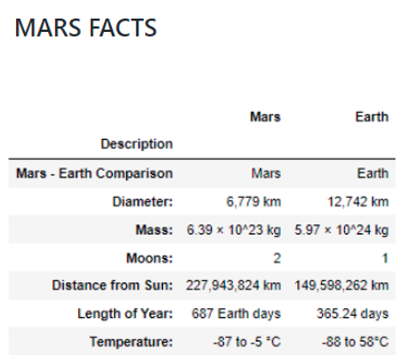

# Mission to Mars Analysis
!(images/hemisphere.PNG)

### Overview
Working with Robin to pursue her dream of working for NASA we used multiple software tools including:
- MongoDB		- Flask
- Bootstrap		- Beautiful Soup
- HTML			- Splinter
and others to scrape data from webpages and display that data on another.

# Results?
Varied.  Here's some beautiful images of how this might have worked out if Flask was working properly in my code.  MongoDB is designed to store the data that is refreshed with the 'scrape new data' button but something has gone awry with my Flask connection and nothing is showing up quite as is should.  It's enough to make me want to move to Mars, quite frankly.  
But Deliverable 1 went swimmingly and scraped this most recent article, if you're looking for Mars News.. I know Robin is.  And before I pack my bags, I better brush up on thse Mars Facts and make an educated decision.
    

## Summary of Mission to Mars:  
To be honest, I think Robin and I are trending as well as any scientist at NASA and we'll get some help from our other data scientist associates after the break and continue to work towards her dream of joining NASA.  Until then, stay safe on whatever planet you call home!